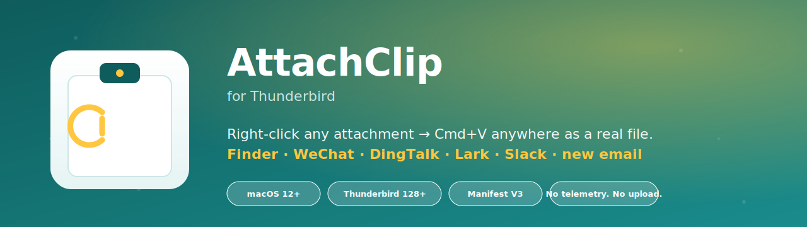

# AttachClip for Thunderbird



> Right-click any email attachment → choose **Copy Attachment as File** →
> **Cmd+V** into Finder, WeChat, DingTalk, Lark, Slack, or a new email.

[](#-installation)
[](#-installation)
[](LICENSE)
[](CHANGELOG.md)
[](PRIVACY.md)

---

## What is this?

Thunderbird's built-in "Copy" action for attachments copies a file name to
the clipboard, not the bytes — so **Cmd+V into Finder, WeChat, Lark, or
a new email never works**. AttachClip fixes that by writing each
attachment to a short-lived local cache and then asking macOS to place
real file URLs on the pasteboard.

```
┌───────────────┐    WebExtension     ┌─────────────────────┐
│  Thunderbird  │ ──────────────────► │ native messaging    │
│  + AttachClip │                     │ helper (Swift)      │
│  (MV3)        │ ◄────────────────── │ ~/Library/Caches/   │
│               │    4-byte JSON      │ AttachClip/sessions/│
└───────────────┘    framing          └─────────────────────┘
                                              │
                                              │ NSPasteboard.writeObjects
                                              ▼
                                ┌───────────────────────────────┐
                                │ macOS pasteboard              │
                                │ (Finder · WeChat · Lark · …)  │
                                └───────────────────────────────┘
```

## Features

- 🖱 **Right-click single attachment** → `Copy Attachment as File`
- 📚 **Right-click "all attachments" on a message** → `Copy All Attachments as Files`
- 🍎 **macOS first-class**: uses `NSPasteboard.writeObjects([fileURLs])`,
  the same API as drag-and-drop in Finder.
- 🧹 **Auto-cleans** its own cache after 72 hours.
- 🔒 **No upload, no telemetry, no IMAP changes** — see [PRIVACY.md](PRIVACY.md).
- 🪶 **Small surface**: ~1,100 lines of Swift, ~600 lines of JavaScript.

## Privacy promise

> AttachClip never sends your email, your attachments, or any metadata
> about them, off your machine. The helper binary is a local JSON
> receiver; it writes files into `~/Library/Caches/AttachClip/`
> and updates the macOS pasteboard. Nothing else.

Read the [full privacy statement](PRIVACY.md).

## Installation

> **macOS only** for this release. Windows / Linux are on the
> [roadmap](ROADMAP.md) — see [docs/upstream-proposal.md](docs/upstream-proposal.md)
> for why a native helper is needed on every platform.

### One-shot install

```bash
git clone https://github.com/xffighting/thunderbird-attachment-clipboard.git
cd thunderbird-attachment-clipboard/native-host/macos
./install.sh                       # builds helper via Swift Package Manager
```

The script will:

1. `swift build -c release` the helper binary.
2. Copy `attachclip-host` into `~/.local/bin/` (or `/usr/local/bin/` with
   `sudo`).
3. Render the native-messaging manifest into
   `~/Library/Application Support/Mozilla/NativeMessagingHosts/com.attachclip.host.json`.

### Load the extension in Thunderbird

1. Restart Thunderbird so it picks up the native messaging manifest.
2. Go to **Tools → Developer Tools → about:debugging** → **This Firefox**.
3. Click **Load Temporary Add-on…** and pick
   `extension/manifest.json` from this repo.
4. The two right-click menu items appear immediately — no restart needed.

## Usage

| Action                                   | Steps                                                            |
| ---------------------------------------- | ---------------------------------------------------------------- |
| Copy one attachment                      | Right-click an attachment → **Copy Attachment as File**          |
| Copy every attachment on a message       | Right-click the message header → **Copy All Attachments as Files** |
| Paste                                    | Switch to Finder / WeChat / Lark / Slack / new mail, Cmd+V       |

You should see `Copied 1 attachment` (or N) toast a moment later.

## Testing matrix

| Paste target                       | Status  | Notes                                         |
| ---------------------------------- | ------- | --------------------------------------------- |
| Finder (Cmd+V into a window)       | ✅ works | Apple Silicon + Intel both confirmed          |
| Thunderbird new mail (Cmd+V)       | ✅ works | Auto-attaches                                 |
| WeChat for Mac                     | ✅ works | Drop-down over compose window                 |
| Lark (飞书)                       | ✅ works | Attach as file                                |
| DingTalk (钉钉)                   | ✅ works | Crop modal must be skipped                    |
| Slack desktop                      | ✅ works | Pastes inline + as attachment                 |

See [docs/testing-matrix.md](docs/testing-matrix.md) for the full manual
test plan.

## Roadmap

Track the planned feature set in [ROADMAP.md](ROADMAP.md). Highlights:

- **v0.2.0** — Windows native helper (PowerShell + .NET 8 tray binary).
- **v0.3.0** — Linux helper (xdg-portal FreeDesktop interface).
- **v0.4.0** — Keyboard shortcut to "Copy attachments from current view".
- **v1.0.0** — Submit to AMO; signed .xpi; auto-update via `browser_specific_settings.update_url`.
- **TBD** — Push a proposal to upstream Thunderbird so a future release
  ships clipboard support natively.

## Contributing

See [CONTRIBUTING.md](CONTRIBUTING.md). All PRs must include a manual
test entry in [docs/testing-matrix.md](docs/testing-matrix.md) and an
update to [CHANGELOG.md](CHANGELOG.md).

## Support

- Bug? Open an issue with the [bug template](.github/ISSUE_TEMPLATE/bug_report.yml).
- Compatibility question? Use the [compatibility template](.github/ISSUE_TEMPLATE/compatibility_report.yml).
- Security issue? Read [SECURITY.md](SECURITY.md) before opening a public ticket.

## License

[MIT](LICENSE) — © 2026 AttachClip contributors.
